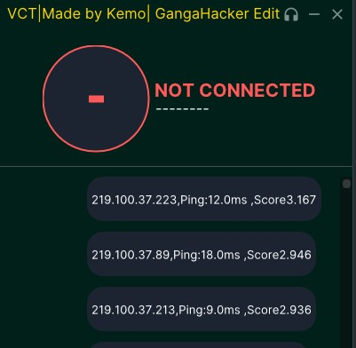
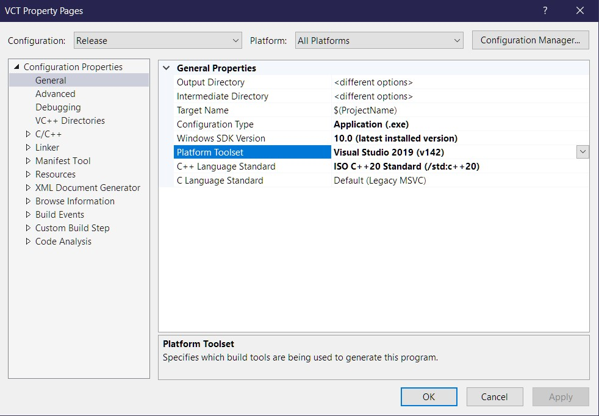
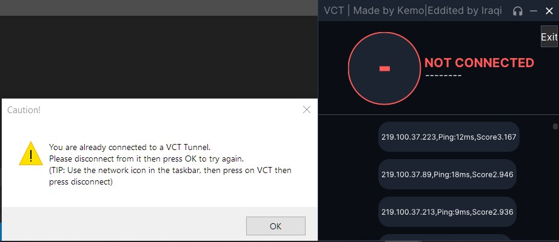

# VCT (Voice Chat Tunnel) - GangaHacker's Fork

This is a fork of Kemo's Voice Chat Tunnel (VCT) project, with bug fixes, minor feature enhancements, and quality-of-life improvements. The original project provides a simple VPN solution optimized for voice chat applications like Discord, prioritizing low latency connections for valorant or league of legends voice chat and others.

## Changes in this Fork

* **Fixed:** Crash on startup when the servers list couldn't be retrieved.
* **Fixed:** Issue where the VPN wouldn't disconnect properly under certain conditions.
* **Improved:** Clarity of connection status messages.
* **Added:** Tooltips to clarify the functionality of UI elements.
* **Added:** Ping to servers and score display for better server selection.

## Features

* **Easy-to-Use Interface:** A simple and clean GUI makes connecting and disconnecting a breeze.
* **Minimizes to Tray:** Keeps VCT running discreetly in the background.
* **Auto-Startup Option:** Configure VCT to start automatically with Windows.

## How to Use

1. **Download:** Download the latest release from the [Releases](https://github.com/GangaHacker/VoiceChatTunnel/releases) section.
2. **Run:** Execute the `VCT.exe` file.
3. **Choose Server:** Choose one of the first few servers they have best ping and score(Quality).
4. **Connect:** Click the power button in the main window to connect to the selected VPN server.
5. **Disconnect:** Click the power button again to disconnect.
Note: Some Dependencies might be missing incase of that error, in that case install [OpenVpn](https://openvpn.net/) or SoftEther VPN for the missing Dependencies or Send me the error and I'll try to add them with future patchs.

## Configuration

VCT currently doesn't offer extensive configuration options. The focus is on simplicity and ease of use. Future updates may include more customizable settings.

## Building from Source (For Developers)

1. **Clone the Repository:** `https://github.com/GangaHacker/VoiceChatTunnel`
2. **Dependencies:**  [All should be included in these files]
3. **Build:** This was built on MSVs studio 

## Troubleshooting

* **Connection Issues:** If you're unable to connect, ensure you have a stable internet connection. Try restarting VCT or your computer. Check firewall settings.
* **"Already Connected" Error:** If you receive this error, make sure any previous VCT connections are closed.(Restart your PC)
* **No Servers Found:** Verify your internet connection and try refreshing the server list. Consider temporarily disabling firewall or antivirus software.

## Known Issues

* **Error:** Undefined RAS Dail Error (5010) (CreateIPForwardEntry) (CreateIPForwardEntry).jpg)
* **Solution:** Restart your PC, this error happens because the program was ended before it could terminate a previous connection. 

* **Error:** You are alread connected to a VCT Tunnel. Please disconnect from it then press OK to try again. (TIP: Use the network icon in the taskbar, then press on VCT then press disconnect) 
* **Solution:** Restart your PC, this error happens because the program was ended before it could terminate a previous connection. 

[Include a screenshot or GIF here]

## Contributing

Contributions are welcome! If you find any bugs or have suggestions for improvements, feel free to open an issue or submit a pull request.

## Credits

* **Original Creator:** Kemo (@xkem0x on Twitter)
* **This Fork Maintainer:** GangaHacker5
* **README Assistance:** Gemini 1.5 Pro 002
* **Special Thanks:**
    * GangaHacker for editing and improvements
    * Defaults, Ramy (@RamyWafik on Twitter)
    * MadTitan (@MadTitan__ on Twitter)
    * Sohila (@ananaymabye on Twitter)

## License

MIT License

Copyright (c) 2024 Ganga Great Hacker Ducker Stucker Pew Pew

## Disclaimer

Use this software responsibly. Be aware of the terms of service of any online platforms you use while connected to the VPN. The maintainers of this fork are not responsible for any misuse of this software.

## Future Development

* Improved server selection algorithms based on ping and other factors.
* Customizable settings for more advanced users.

## About

VCT (Voice Chat Tunnel) is a tool designed to address voice chat problems experienced by Valorant players in Egypt. It provides a low-latency VPN connection optimized for voice communication, reducing lag and improving the quality of in-game voice chat.
